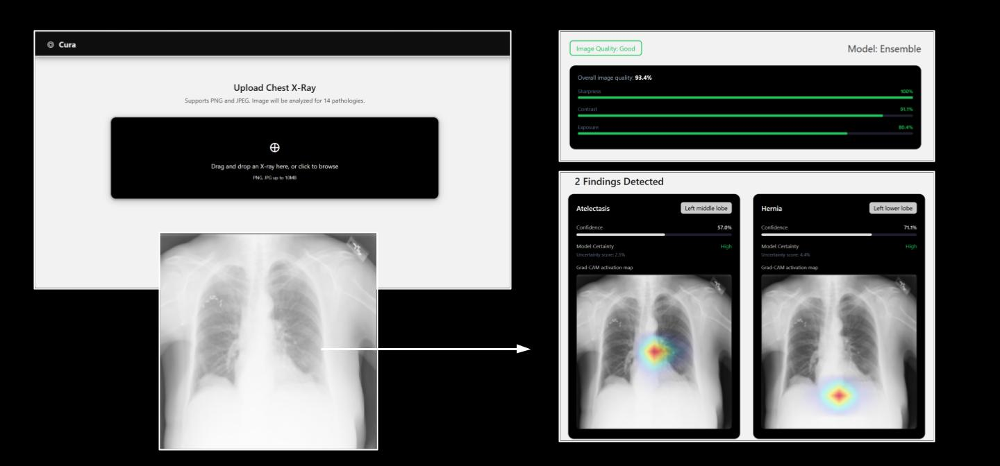

# Cura: An AI-Powered Application For Chest X-Ray Analysis

Cura is a production-deployed, end-to-end medical imaging platform that performs automated multi-label pathology detection across 14 chest diseases. It combines image quality assessment, deep learning ensemble inference, Monte Carlo Dropout uncertainty estimation, anatomically grounded explainability, and a full-stack web interface.

**Live demo:** https://cura-xray.vercel.app  
**API docs:** https://mjrq-cura.hf.space/docs  
**Model weights:** https://huggingface.co/mjrq/cura-chest-xray

---

## Overview

A chest X-ray uploaded through the web interface is processed through a sequential pipeline:

1. Image Upload
2. Image Quality Assessment (blur, contrast, exposure)
3. Three Model Ensemble Inference (DenseNet121 + DenseNet169 + ConvNeXt-Tiny)
4. Monte Carlo Dropout Uncertainty Estimation
5. Grad-CAM x TorchXRayVision Anatomical Segmentation
6. Structured JSON Diagnostic Report
7. React Frontend

--- 

---

## Results

### 3-Model Ensemble (NIH ChestX-ray14 Test Set)

| Disease | AUC | F1 (optimal threshold) | Threshold |
|---|---|---|---|
| Atelectasis | 0.8255 | 0.4323 | 0.55 |
| Cardiomegaly | 0.9067 | 0.3931 | 0.55 |
| Effusion | 0.8906 | 0.5815 | 0.55 |
| Infiltration | 0.7191 | 0.4156 | 0.55 |
| Mass | 0.8659 | 0.4295 | 0.55 |
| Nodule | 0.7784 | 0.3342 | 0.50 |
| Pneumonia | 0.7812 | 0.1053 | 0.45 |
| Pleural Thickening | 0.8256 | 0.2381 | 0.45 |
| Pneumothorax | 0.8687 | 0.3591 | 0.50 |
| Consolidation | 0.8065 | 0.2417 | 0.45 |
| Edema | 0.8870 | 0.2691 | 0.50 |
| Emphysema | 0.9218 | 0.4953 | 0.45 |
| Fibrosis | 0.8201 | 0.1787 | 0.45 |
| Hernia | 0.9127 | 0.6207 | 0.60 |
| **Mean** | **0.8539** | — | — |

### Architecture Benchmark

| Architecture | Mean AUC
|---|---|
| ConvNeXt-Tiny | 0.8449 |
| DenseNet121 | 0.8435 |
| DenseNet169 | 0.8414 |
| ResNet50 | 0.8368 |
| EfficientNet-B0 | 0.8291 |
| **3-model ensemble** | **0.8539** |
| CheXNet (Rajpurkar et al., 2017) | 0.841 |

Adding ResNet50 or EfficientNet-B0 to the ensemble did not improve performance, confirming that architectural diversity (DenseNet + ConvNeXt) drives the gain rather than ensemble size alone.

---

## Features

**Image Quality Assessment**
Rejects unacceptable images before inference using three classical CV metrics:
- Blur detection via Laplacian variance
- Contrast assessment via pixel intensity standard deviation
- Exposure assessment via mean pixel intensity

All thresholds empirically calibrated from 500 random NIH dataset samples. Raw scores are mapped to intuitive 0-100% quality scores via parameterized sigmoid functions centered at the rejection threshold.

**Multi-Label Classification**
Classifies 14 chest pathologies simultaneously. Each image can have multiple simultaneous findings. Uses AsymmetricLoss which applies different focal weights to positive and negative samples, designed specifically for multi-label classification with severe class imbalance.

**Monte Carlo Dropout Uncertainty Estimation**
Runs 10 stochastic forward passes per model (30 total across the ensemble) with dropout active during inference. The variance across passes measures model uncertainty per disease, reported as High / Moderate / Low confidence.

**Anatomically Grounded Explainability**
Grad-CAM heatmaps from DenseNet169 are multiplied element-wise with TorchXRayVision PSPNet anatomical segmentation masks (left lung, right lung, cardiac silhouette). Peak activation within each masked region determines the output label, producing human-readable descriptions like "Right lower lobe" rather than raw pixel coordinates.

**Per-Class Calibrated Thresholds**
Confidence thresholds derived by maximizing F1 score independently for each disease on the held-out test set. Replaces a naive fixed cutoff with clinically calibrated reporting.

---

## API

### POST /analyze

Accepts a chest X-ray image, returns a structured diagnostic report.

**Request:** `multipart/form-data` with `file` field (PNG or JPEG)

**Response:**
```json
{
  "passed_quality": true,
  "image_quality": "Good",
  "quality_metrics": {
    "blur_score": 299.58,
    "contrast_score": 63.41,
    "mean_brightness": 171.06
  },
  "quality_scores": {
    "sharpness": 94.2,
    "contrast": 81.7,
    "exposure": 73.4,
    "overall": 87.6
  },
  "diagnoses": [
    {
      "disease": "Atelectasis",
      "confidence": 0.6794,
      "uncertainty": 0.032,
      "confidence_level": "High",
      "threshold_used": 0.55,
      "affected_region": "Right middle lobe",
      "heatmap_base64": "..."
    }
  ],
  "models": ["densenet121", "densenet169", "convnext_tiny"],
  "n_mc_passes": 30
}
```

### GET /health

Returns server and ensemble status.

---

## Dataset

**NIH ChestX-ray14** — 83,703 frontal chest X-rays at 224×224 pixels
across 14 disease labels.

- **Source:** [Kaggle: NIH Chest X-ray 14 (224×224 resized)](https://www.kaggle.com/datasets/khanfashee/nih-chest-x-ray-14-224x224-resized)
- **Split by patient ID** to prevent data leakage — all images from one
  patient assigned to exactly one split
- **24,644 train / 3,080 val / 3,081 test patients**
- **Zero patient overlap** verified programmatically across all splits
- **Dataset-specific normalization:** mean=0.4967, std=0.2478

---

## Training

### Configuration

| Parameter | Value |
|---|---|
| Loss | AsymmetricLoss (gamma_neg=4, gamma_pos=1, clip=0.05) |
| Optimizer | AdamW (lr=1e-4, weight_decay=1e-4) |
| Scheduler | CosineAnnealingLR (T_max=epochs, eta_min=1e-6) |
| Batch size | 32 (DenseNet121, ResNet50, EfficientNet-B0) |
| Batch size | 64 (DenseNet169, ConvNeXt-Tiny) |
| Normalization | mean=0.4967, std=0.2478 (dataset-specific) |
| Augmentation | RandomRotation(7°), RandomAffine(translate=0.08), ColorJitter(brightness=0.1, contrast=0.1) |
| Platform | Kaggle, Single NVIDIA T4 GPU, AMP Enabled |
| Early stopping | Patience=5 on validation AUC |

### Key Methodological Decisions

**Patient-aware splits**
The NIH dataset contains multiple scans per patient. Image-level splits allow patient anatomy to appear in both training and test sets, inflating metrics. All images from one patient are assigned to exactly one split.

**AsymmetricLoss over BCE + pos_weights**
Standard BCE with pos_weights (Hernia: 466x, Pneumonia: 80x) produced extremely aggressive gradient signals that destabilized training. AsymmetricLoss addresses multi-label imbalance more elegantly by applying different focal parameters to positive (gamma=1) and negative (gamma=4)
samples, with probability margin shifting (clip=0.05) to reduce the contribution of easy negatives.

**Dataset-specific normalization**
X-ray pixel distributions (mean=0.4967) differ meaningfully from ImageNet (mean=0.456). Computed using the computational variance identity in a single pass over 5,000 random samples.

**Ensemble selection**
Five architectures were benchmarked. The 3-model ensemble
(DenseNet121 + DenseNet169 + ConvNeXt-Tiny) matched the 5-model ensemble AUC (0.8539) while keeping inference time lower. ResNet50 and EfficientNet-B0 were excluded as they added no ensemble diversity benefit.

**Single GPU training**
DataParallel across two T4 GPUs caused a RAM leak via uncollected C++ memory fragments in the GPU-CPU communication layer. All models trained on a single T4 with AMP (Automatic Mixed Precision) providing 4x speedup over float32.

---

## Setup

### Backend

```bash
# Install dependencies
pip install -r backend/requirements.txt

# Start API server
uvicorn backend.api.main:app --reload --port 8000
```

Models are downloaded automatically from Hugging Face Hub on first startup. No manual checkpoint management required.

### Frontend

```bash
cd frontend
npm install
npm run dev
```

Open `http://localhost:5173`

### Docker (full stack)

```bash
docker compose up
```

---

## Technology Stack

**Machine Learning**: Python, PyTorch, Torchvision, TorchXRayVision, scikit-learn, NumPy, Pandas, OpenCV, Pillow, safetensors

**Backend**: FastAPI, Uvicorn, Hugging Face Hub

**Frontend**: React, Vite, Axios, React Dropzone

**Infrastructure**: Docker, Docker Compose, Nginx, Git LFS

**Cloud**: Hugging Face Spaces (backend), Vercel (frontend), Kaggle Notebooks (training)

---

## Known Limitations

- **Infiltration** (AUC 0.72): lowest performing disease due to non-specific diffuse appearance overlapping many conditions
- **Pneumonia F1** (0.11): poor F1 despite reasonable AUC, reflects severe class imbalance and NIH label noise (~10-20% estimated error rate)
- **Label noise**: NIH ChestX-ray14 labels were extracted from radiology reports via NLP, not verified by radiologists
- **Not clinically validated**: performance on non-NIH imaging equipment, patient demographics, or imaging protocols is unknown.
- A student project intended as a research and decision support tool only.

## Future Work (Not Anytime Soon)

- Vision Transformer backbone (Swin-B or BioViL-T) for higher AUC
- Multi-dataset training (MIMIC-CXR + CheXpert + NIH)
- Deep ensemble with temperature scaling for calibrated uncertainty
- Progressive resolution training (224 → 384 → 512)
- LLM-generated clinical narrative reports
- Subgroup fairness analysis by age, sex, and demographics
- Knowledge distillation from ensemble into single fast model

---

## References

- Rajpurkar et al. (2017). *CheXNet: Radiologist-Level Pneumonia Detection on Chest X-Rays with Deep Learning.* arXiv:1711.05225
- Wang et al. (2017). *ChestX-ray8: Hospital-scale Chest X-ray Database and Benchmarks.* CVPR 2017
- Ridnik et al. (2021). *Asymmetric Loss for Multi-Label Classification.* ICCV 2021
- Selvaraju et al. (2017). *Grad-CAM: Visual Explanations from Deep Networks via Gradient-based Localization.* ICCV 2017
- Gal & Ghahramani (2016). *Dropout as a Bayesian Approximation: Representing Model Uncertainty in Deep Learning.* ICML 2016
- Cohen et al. (2022). *TorchXRayVision: A library of chest X-ray datasets and models.* MIDL 2022

---

## License

MIT